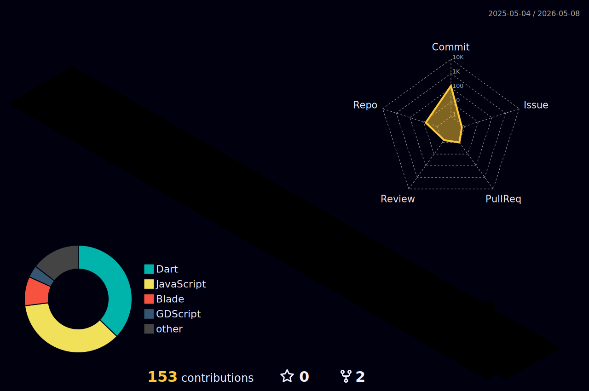

<!-- Animated Header Wave -->

  

<!--horizontal divider(gradiant)-->

<!-- Main Title Retro -->

  

<!-- Typing SVG Animation -->

  

<!-- Retro Gaming Terminal Effect -->

  

<!--- snake -->

  <picture>
    <source media="(prefers-color-scheme: dark)" srcset="https://raw.githubusercontent.com/JulioCesarAnturiano/JulioCesarAnturiano/output/github-contribution-grid-snake-dark.svg">
    <source media="(prefers-color-scheme: light)" srcset="https://raw.githubusercontent.com/JulioCesarAnturiano/JulioCesarAnturiano/output/github-contribution-grid-snake.svg">
    
  </picture>

 

<!-- Section Title -->

  

<!-- Retro Pixel Badges -->

  
  
  
  

 

<!-- About Me Retro Style -->

  

 

<!-- Stats Title -->

  

<!--- stats & Trophy (start) -->

<table align="center">
<tr border="none">
<td width="50%" align="center">

  
    
  
</td>

<td width="50%" align="center">

  

</td>
</tr>
</table>

<!-- Trophy Title -->

  

<!--- trophy -->

  

<!-- GitHub Activity Graph -->
 

  

  

<!--- stats (end) -->

 

<!-- Tech Stack Title -->

  

<!--tech stack icons-->

  

<!-- Animated Coding GIF -->

  

 

<!-- 3D Contribution Title -->

  

<!-- GitHub 3D Contribution Graph -->

  

<!-- Pixel Art Divider -->

  

 

<!-- Connect Title -->

  

<!-- Animated connection line -->

  

<!--icons and links-->

 

<!--profile visit count-->

<!-- Retro Visitor Counter -->

  

 

<!-- Random Dev Quote -->

  

 

<!-- Animated Footer Wave -->

  

<!-- Retro Footer Text -->

  

 

<!-- Extra Retro Badge -->

